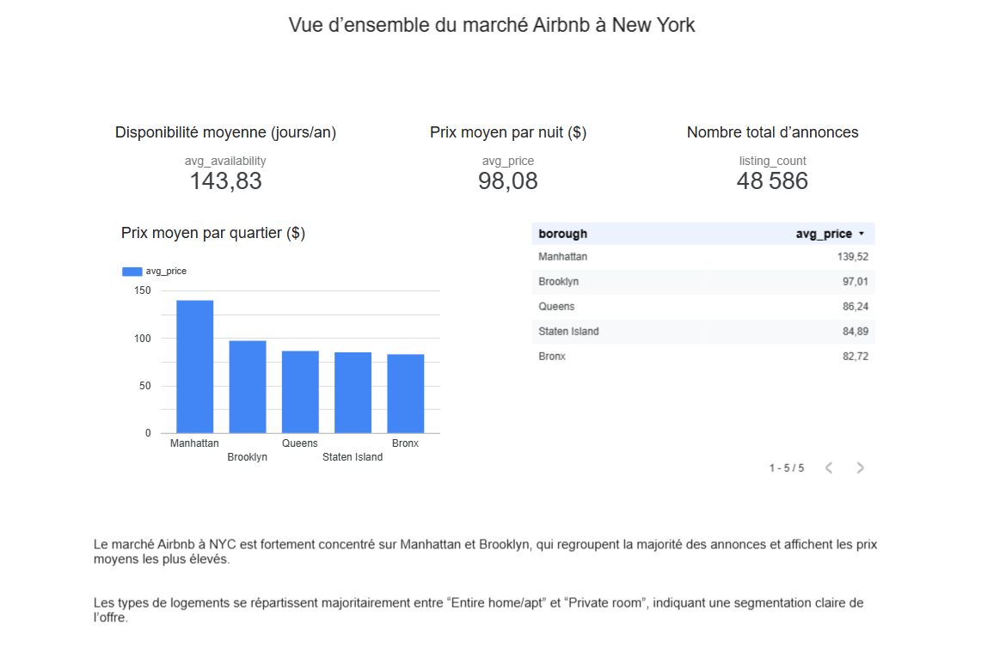

# 🏙️ NYC Airbnb Market Analysis

## Objectif
Analyser le marché Airbnb à New York afin d’identifier les différences de prix,
de disponibilité et les opportunités potentielles.

## Dataset
NYC Airbnb Open Data (Kaggle)

## Méthodologie
- Nettoyage et feature engineering (Python, Pandas)
- Modélisation analytique (tables dimension / fait)
- Visualisation (Looker Studio)

## 📊 Dashboard interactif
👉 https://lookerstudio.google.com/reporting/dbb53904-613f-42b8-953e-dc0fa546c940/page/CMnkF

## Aperçu

## Technologies
- Python
- Pandas
- Google Colab
- KaggleHub
- Looker Studio
